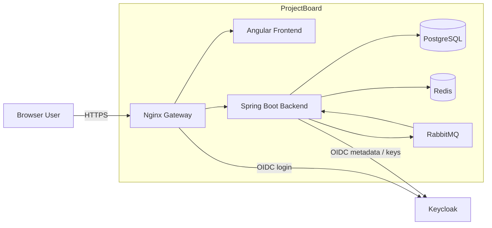

# Container Diagram

[Back to High-Level Design](../hld.md)

This diagram shows the main ProjectBoard runtime containers and their primary relationships.



# Responsibilities

| Container | Responsibility |
| --- | --- |
| Nginx Gateway | HTTPS entry, routing, reverse proxy, basic rate limiting |
| Angular Frontend | Browser UI using the Backend API |
| Spring Boot Backend | Business logic, authorization, transactions, messaging |
| PostgreSQL | Authoritative business data, Activity/Audit, Outbox |
| Redis | Temporary edit-lock and rate-limit state |
| RabbitMQ | Asynchronous event transport |
| Keycloak | User authentication and token issuance |

The Backend is a Modular Monolith containing:

```text
project
membership
story
task
sprint
board
shared
```

In Version 1, the Outbox Publisher and Activity/Audit Consumer run inside the Backend process.

# Key Boundaries

- Frontend does not directly access PostgreSQL, Redis, or RabbitMQ.
- PostgreSQL is the authoritative business store.
- Redis is temporary and non-authoritative.
- RabbitMQ is transport, not business storage.
- Keycloak authenticates users.
- Backend performs Project-specific authorization.
- Gateway is the public application entry point.

# Scope

Not shown here:

- Vault and MinIO;
- monitoring infrastructure;
- CI/CD;
- Kubernetes topology;
- backup infrastructure;
- detailed networking;
- future AI Service and Ollama.

These belong to their dedicated architecture documents and diagrams.