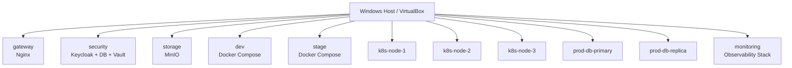
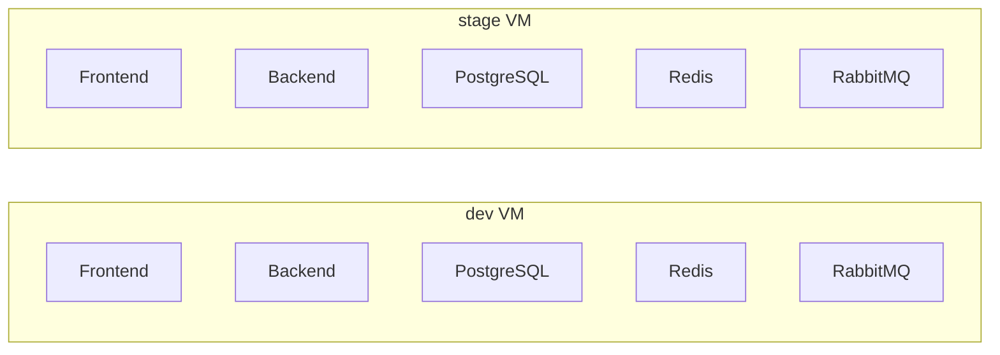
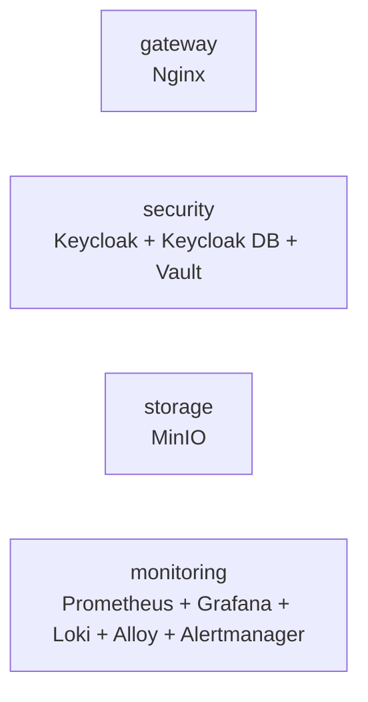
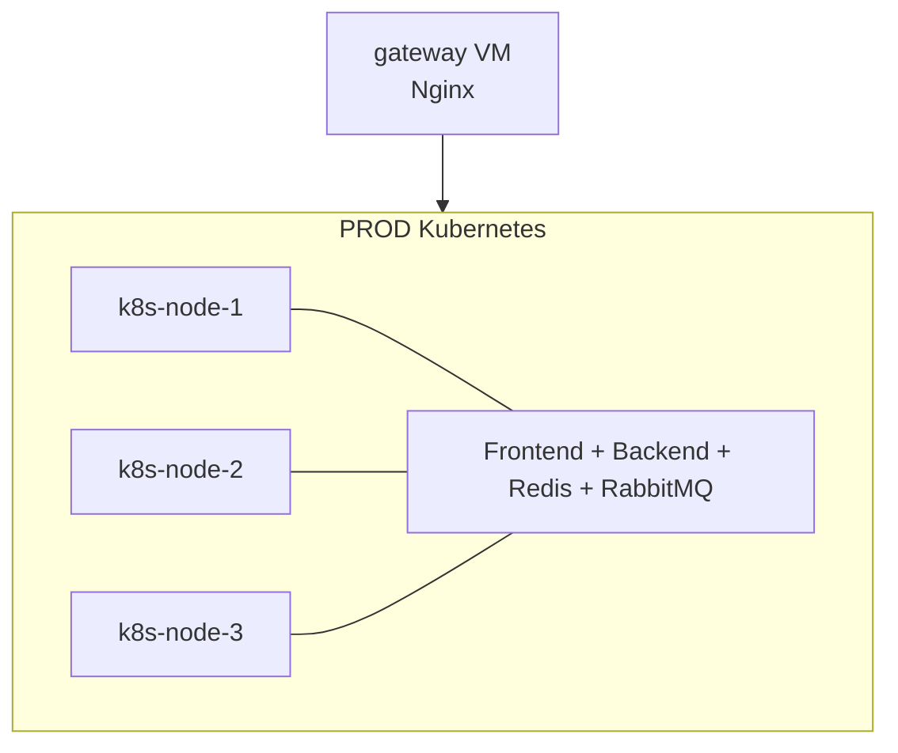
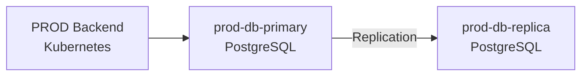
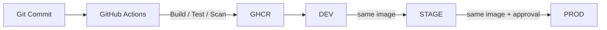
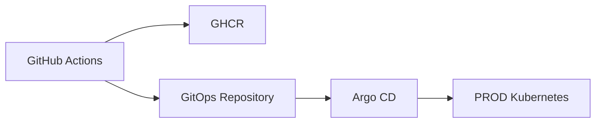
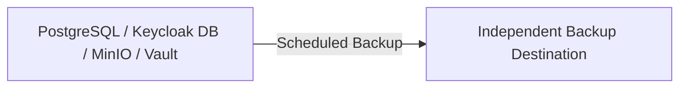
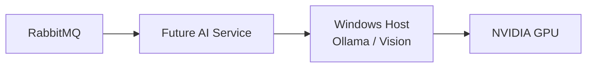

# Deployment Diagrams

[Back to Deployment Architecture](../deployment-architecture.md)

This document shows where ProjectBoard components are deployed.
Network, security, observability, CI/CD, backup, and AI details belong to their dedicated documents.

# 1. Home-Lab Topology


All Linux VMs use Debian 13.
The Windows host also provides the future GPU runtime.

# 2. DEV and STAGE


Both environments use Docker Compose and keep separate data, credentials, Redis state, RabbitMQ state, and configuration.

# 3. Shared Infrastructure


These are shared deployment roles with environment-specific access and policies.

# 4. PROD Kubernetes Target


PROD targets a three-node Kubernetes cluster.
Exact distribution, CNI, ingress, namespaces, and NetworkPolicies remain open.

# 5. PROD PostgreSQL


Production PostgreSQL remains outside Kubernetes.
The replica is not a backup and automatic failover is future work.

# 6. Component Placement
| Component | DEV | STAGE | PROD |
| --- | --- | --- | --- |
| Frontend | Compose | Compose | Kubernetes |
| Backend | Compose | Compose | Kubernetes |
| PostgreSQL | DEV VM | STAGE VM | Dedicated VM |
| Redis | Compose | Compose | Kubernetes |
| RabbitMQ | Compose | Compose | Kubernetes |
| Outbox Publisher | Backend process | Backend process | Backend workload |
| Audit Consumer | Backend process | Backend process | Backend workload |

Shared infrastructure:

| Component | Placement |
| --- | --- |
| Nginx | `gateway` VM |
| Keycloak + DB + Vault | `security` VM |
| MinIO | `storage` VM |
| Observability stack | `monitoring` VM |

# 7. Artifact Promotion


Application images are built once and promoted unchanged.
Detailed promotion behavior belongs to `../cicd-design.md`.

# 8. GitOps Progression


Learning progression:

```text
Manual Deployment
→ CI/CD
→ Direct Kubernetes Deployment
→ GitOps
→ Argo CD
```

Argo CD runs inside Kubernetes.

# 9. Backup Placement


Backups are stored outside the source service.
Exact destination belongs to `../backup-recovery.md`.

# 10. Future AI Placement


AI is outside Version 1.
The AI Service and Ollama are not publicly exposed.

# 11. Fixed Decisions
1. DEV uses a dedicated Docker Compose VM.
2. STAGE uses a dedicated Docker Compose VM.
3. PROD targets three Kubernetes nodes.
4. PROD PostgreSQL uses dedicated primary and replica VMs.
5. PostgreSQL remains outside Kubernetes.
6. RabbitMQ and Redis are environment-specific.
7. Outbox Publisher and Audit Consumer run in the Backend in Version 1.
8. Keycloak and Vault share the Security VM.
9. MinIO runs on the Storage VM.
10. Observability runs on the Monitoring VM.
11. Nginx runs on the Gateway VM.
12. Images are built once and promoted unchanged.
13. GitOps follows direct Kubernetes deployment.
14. AI remains outside Version 1.

# 12. Open Decisions
1. VirtualBox network/IP layout.
2. Management-access mechanism.
3. VirtualBox Terraform provider.
4. Internal TLS boundaries.
5. Kubernetes distribution, CNI, ingress, and namespaces.
6. Direct CI/CD deployment path.
7. Backup destination.
8. Kubernetes activation phase.
9. Resource adjustments after measurement.
10. Future AI Service placement.