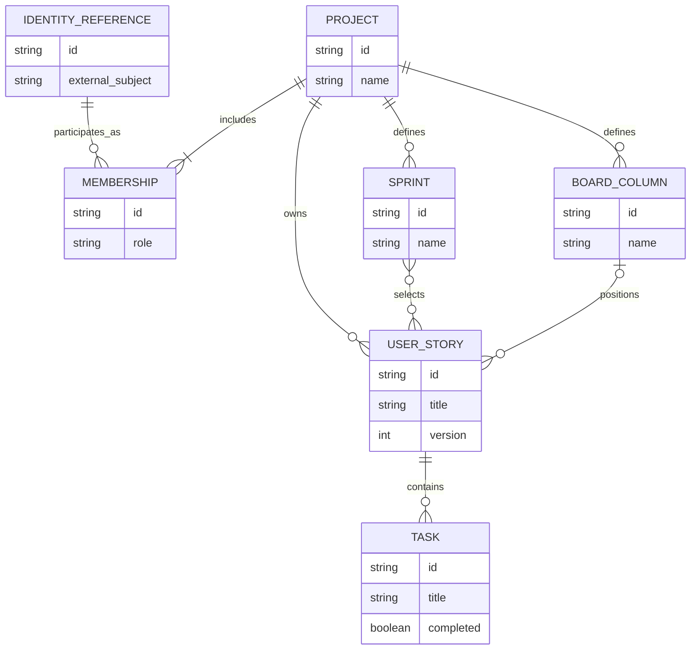

# ProjectBoard Conceptual ERD

| Field | Value |
| --- | --- |
| Status | Working conceptual baseline |
| Domain | [Domain Model](../domain-model.md) |
| Database | [Database Design](../database-design.md) |

This diagram shows the Version 1 core business relationships.

It is conceptual and does not define:
- physical foreign keys;
- association tables;
- SQL types;
- Board ordering representation;
- Sprint-to-UserStory persistence.

# Core Model

# Model Rules

- Identity References connect Keycloak identities to Project memberships.
- A Project has one or more memberships.
- A Project owns UserStories, Sprints, and BoardColumns.
- A UserStory contains Tasks.
- A Sprint selects UserStories, not Tasks.
- A UserStory acts as the Kanban card.
- BoardColumn represents workflow placement.
- A separate persistent `Board` entity is not required.
- `UserStory.version` represents optimistic locking.

# Deferred Physical Design

The following remain implementation decisions:

- identifier strategy;
- foreign-key placement;
- Sprint/UserStory association representation;
- Board placement and ordering representation;
- cascade/restrict rules;
- SQL naming and data types.

These are defined later through `database-design.md` and Flyway migrations.