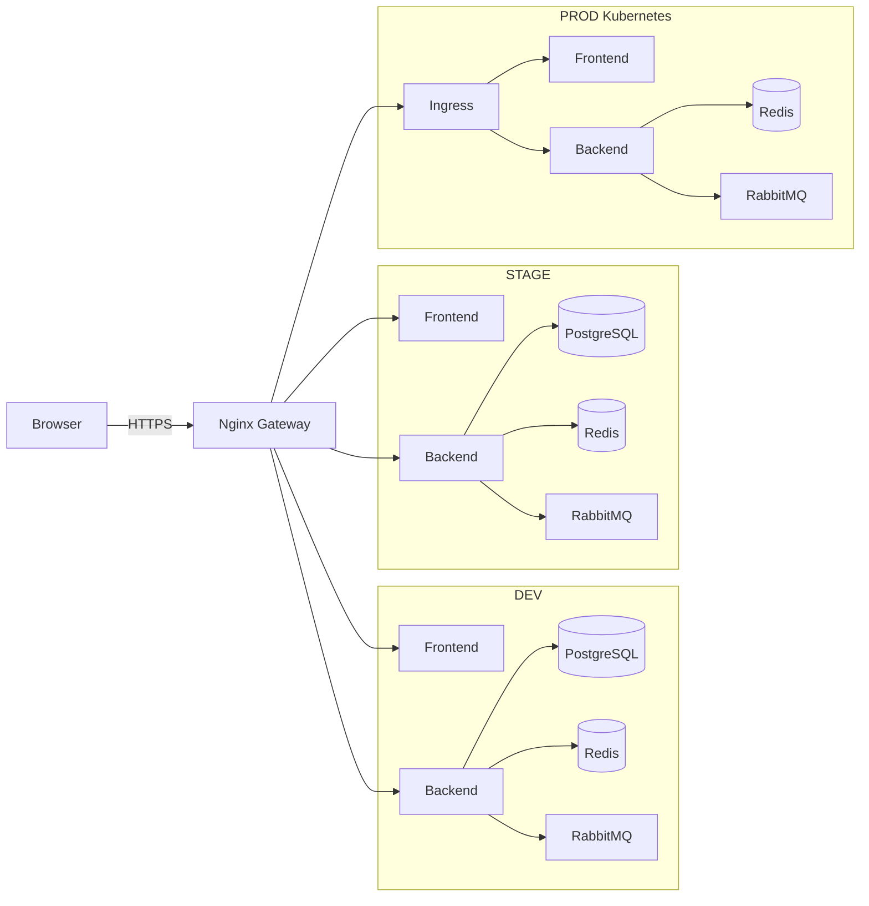
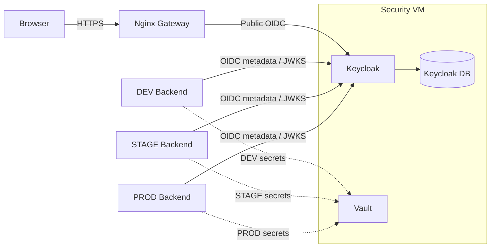
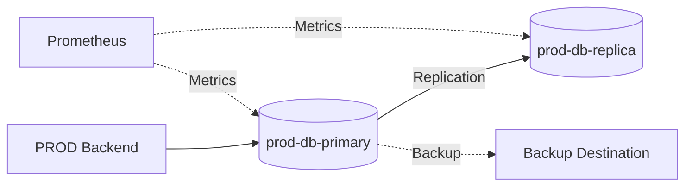
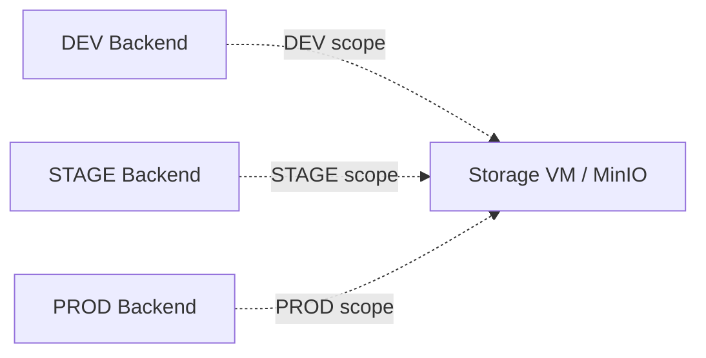
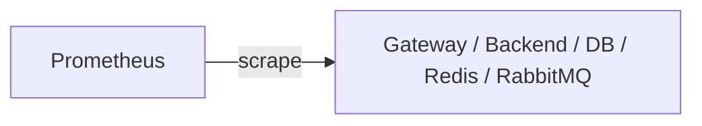
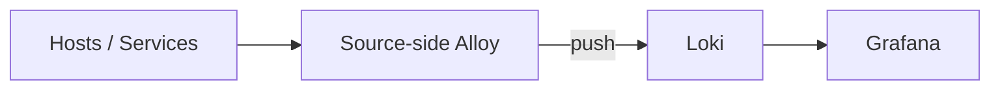
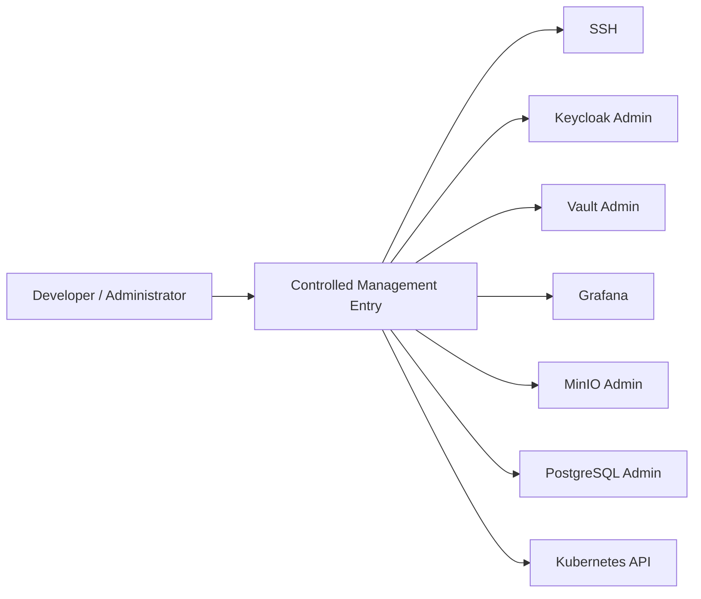
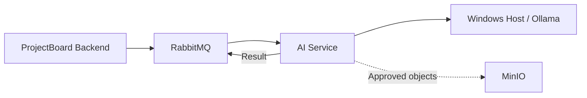

# ProjectBoard Network and Trust-Boundary Diagrams

[Back to Network Design](../network-design.md)

This document visualizes the main ProjectBoard network and trust boundaries.

```text
Default Deny + Explicitly Allowed Communication
```

# 1. Main Application Network


Public traffic enters only through the Gateway.
DEV, STAGE, and PROD remain isolated.

# 2. Authentication and Secrets


Keycloak public authentication and administration use separate trust paths.
Lower environments cannot access higher-environment secrets.

# 3. Production Database Boundary


Production PostgreSQL remains outside Kubernetes.
The replica is not a backup.

# 4. Shared Storage


Each environment uses separate MinIO credentials and scopes.

# 5. Observability Flows
Metrics:



Logs:



Monitoring receives only required telemetry access.

# 6. Management Plane


The exact management mechanism remains open.
Administrative interfaces are not public.

# 7. Future AI Boundary


AI is outside Version 1.

Prohibited:

```text
Browser ─X─► AI Service
Browser ─X─► Ollama
AI Service ─X─► ProjectBoard PostgreSQL
Ollama ─X─► ProjectBoard PostgreSQL
```

# 8. Prohibited Paths
| Source | Destination |
| --- | --- |
| Internet | PostgreSQL / Redis / RabbitMQ / Vault |
| Internet | SSH / Kubernetes API |
| Internet | MinIO / Monitoring administration |
| Internet | AI Service / Ollama |
| Browser | PostgreSQL / Redis / RabbitMQ / Vault |
| Browser | AI Service / Ollama |
| Gateway | PostgreSQL / Redis / RabbitMQ / Vault |
| DEV/STAGE | PROD data / secrets / messaging |
| AI Service | ProjectBoard PostgreSQL |
| Ollama | ProjectBoard PostgreSQL |

Anything not explicitly allowed is denied by default.

# 9. Fixed Rules
1. Public ProjectBoard traffic enters through the Gateway.
2. Public Keycloak OIDC traffic uses the Gateway.
3. DEV, STAGE, and PROD remain isolated.
4. PostgreSQL, Redis, RabbitMQ, and Vault are not public.
5. Kubernetes API and administrative interfaces are management-only.
6. Redis and RabbitMQ are environment-specific.
7. PROD PostgreSQL remains outside Kubernetes.
8. Replication does not replace backup.
9. Shared infrastructure uses environment-specific credentials and policies.
10. Monitoring receives only required telemetry connectivity.
11. AI and Ollama have no direct ProjectBoard database path.
12. Default deny applies to unlisted traffic.