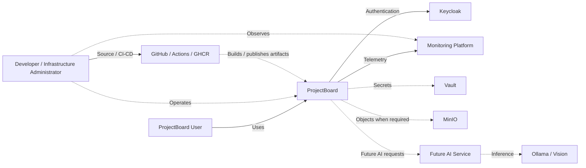

# System Context Diagram

[Back to High-Level Design](../hld.md)

This diagram shows ProjectBoard as one system and the main external actors and surrounding systems.

Internal components such as PostgreSQL, Redis, RabbitMQ, and Kubernetes are intentionally omitted.

# Boundaries

- Users interact with ProjectBoard through the web application.
- Keycloak owns authentication; ProjectBoard owns business authorization.
- `PROJECT_OWNER` and `MEMBER` are internal roles, not external actors.
- GitHub supports source control, CI/CD, and artifact publishing.
- Monitoring is part of the Version 1 architecture.
- Vault is the centralized secrets-management target.
- MinIO is shared object storage used only when required by a concrete feature.
- AI Service and Ollama/Vision are outside Version 1.
- AI-generated results cannot directly modify ProjectBoard business data.

# Scope

Not shown at this level:

- PostgreSQL;
- Redis;
- RabbitMQ;
- internal Backend modules;
- Docker Compose;
- Kubernetes workloads;
- network and firewall details;
- backup infrastructure.

These belong to lower-level architecture diagrams.